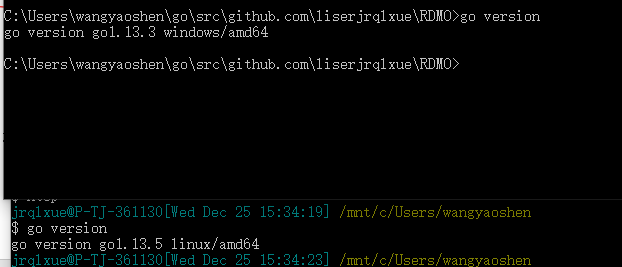
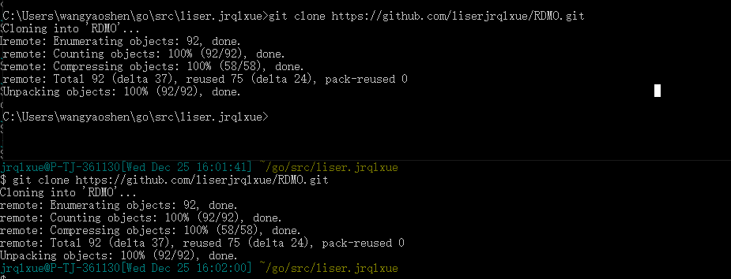
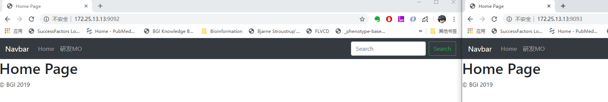
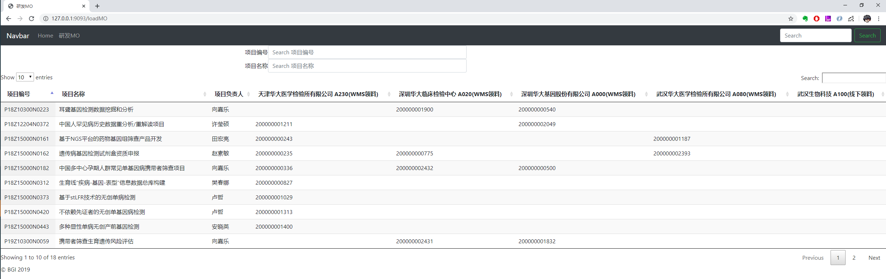
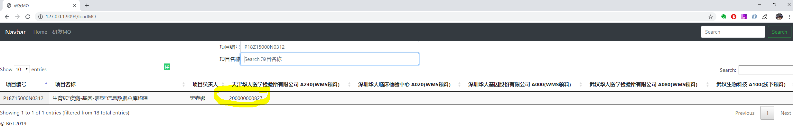
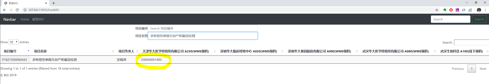
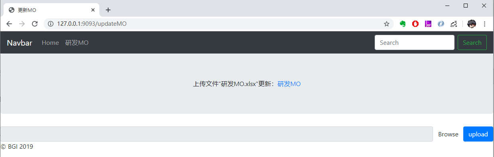
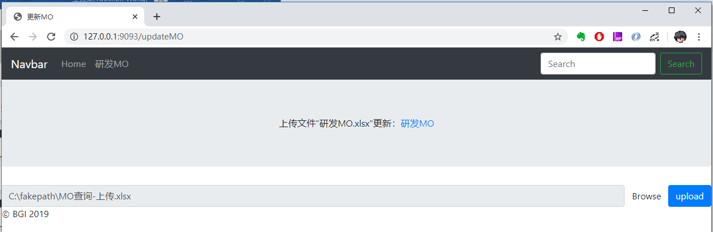
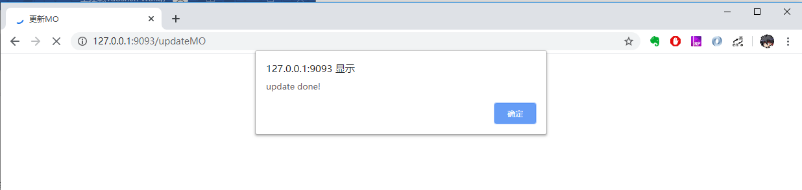

# RDMO
研发物料MO查询系统

## 运行环境
### 硬件
CPU 1核，内存10M（不包括系统本身的运行消耗）

### 支持软件
Go 1.3以上版本（编译需要，编译后的二进制软件可直接运行不需要其他依赖）

### 系统平台
因为Go语言具有跨平台编译支持，而软件本身没有依赖特定系统平台的库文件，所以Windows、Linux、MacOS理论上均支持。
目前已测试的系统平台有Windows10 核 Linux 2.6.32

## 使用说明
### 安装依赖
因为编译需求，需要安装Go 1.3以上版本（以下版本也可以，只是依赖包管理需要自己配置处理，并关闭go mod模式）
安装方式如下：
1.	去golang官方网站下载对应系统的软件压缩包（解压可直接使用）

2.	安装golang软件

  1.	Windows下直接双击msi包安装
  2.	Linux下直接解压tar.gz包
  3.	配置好GOROOT、GOPATH等环境变量，并将go添加如PATH查找环境
  4.	`go env -w GO111MODULE="on"` 开启go mod
  5.	详情参考官网指导说明
    
3.	测试安装成功    
命令行下`go version`测试安装成功并查看go 版本
 

### 下载软件源码
1.	用git下载源码（需要安装git）  
`git clone https://github.com/liserjrqlxue/RDMO.git`
 
2.	直接解压源码

### 编译软件
进入源码目录后通过`go build`编译软件，保持联网状态自动下载依赖包  
或者直接使用源码包内已经编译好的软件：`RDMO.exe` （Windows）或 `RDMO`（Linux）

### 启动Web服务
因为web服务需要额外的配置文件和数据文件，所以需要在源码包目录内运行  
`RDMO.exe`（Windows）或者`./RDMO`（Linux）  
默认端口`:9091`，如果被占用或者需要用其他端口，通过参数`-port`指定`./RDMO -port :9093`  
然后就可以通过本机ip+指定端口作为网址访问Web服务了
 

### 查询功能
进入主页后点击研发MO或者直接通过类似`http://127.0.0.1:9093/loadMO`的网址进入MO查询页面
 
在项目编号栏输入要查询的项目编号，或者在项目名称栏输入要查询的项目名称
 
 

### 更新功能
将查询页面网址中的`loadMO`修改成`updateMO`进入查询页面，为避免其他人员误操作，没有把该页面放入网页快捷超链接中
 
点击**Browse**浏览本地文件选择更新的MO excel上传
 
然后点击蓝色按钮**upload**提交上传更新数据，完成后会显示弹窗`update done!`
 
 
### 出错和恢复
1.	报类似“listen tcp :9092: bind: address already in use”的错误，是端口已被占用，用-port修改新的未被占用的端口即可
2.	其他异常，请检查网络连接、防火墙设置等网络问题后重启
3.	如无法解决请提报[issue](issue)
